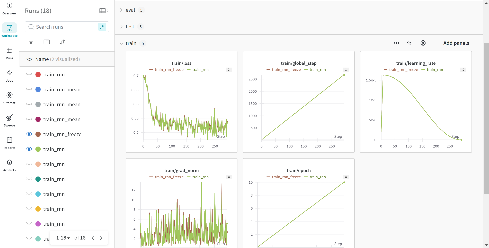

[Main Page](https://pufanyi.github.io/SC4002-Project/) | [Report](https://pufanyi.github.io/SC4002-Project/SC4002_Project.pdf)

## Installation

```bash
# Create a new conda environment
conda create --name sc4002 python=3.11
conda activate sc4002

# Install the package
python -m pip install -e .
```

## Training

Before training, make sure to activate the [Weights & Biases](https://wandb.ai/).

```bash
wandb login
```

After that, you can run the training script.

```bash
sh scripts/train.sh
```

To run the parameter search, you can run the search script by

```bash
bash scripts/train_rnn_sweep_not_freeze.sh
```

You can find how to run other model using different scripts in the folder

To customize the training parameters, you simply need to pass in other args when running the python program. The detail of the config is listed below. You can pass in other training args in the `TrainingArguments` in huggingface to control other parameters such as `batch_size`, `learning_rate` etc.

```python
from dataclasses import dataclass, field
from typing import Optional

from transformers import TrainingArguments


@dataclass
class ModelArguments:
    model_type: str = field(default=None)
    input_size: int = field(default=300)
    hidden_size: int = field(default=512)
    download_repo: str = field(default="kcz358/glove")
    tokenizer_path: str = field(default="glove.840B.300d/glove.840B.300d.tokenizer.json")
    word_embed_path: str = field(default="glove.840B.300d/glove.840B.300d.safetensors")
    freeze_word_embed: bool = field(default=False)


@dataclass
class DataArguments:
    dataset_name: str = field(default="rotten_tomatoes")
    train_split: str = field(default="train")
    val_split: str = field(default="validation")
    test_split: str = field(default="test")


@dataclass
class CustomTrainingArguments(TrainingArguments):
    wandb_project: Optional[str] = field(default="sc4002")
    sweep_config: Optional[str] = field(default=None)
    sweep_count: Optional[int] = field(default=20)

```

## Training Logs

All the training logs are being logged in the [Weights & Biases](https://wandb.ai/). Here is an example of the training logs.



## Unit Test

We add some of the basic unit testing in the run suite. If you want to run the testing on the test set or the val set, it is being logged at every train and their is no need to run extra scripts.

```bash
python test/run_suite.py
```
